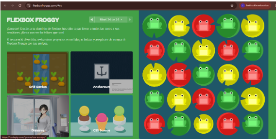
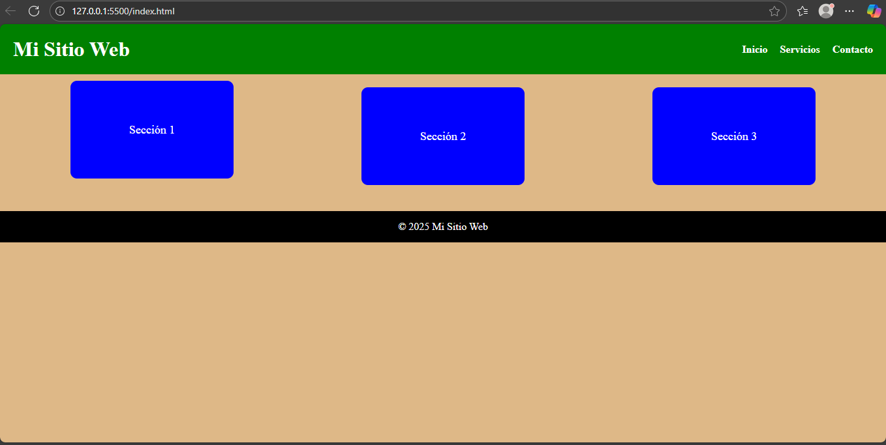
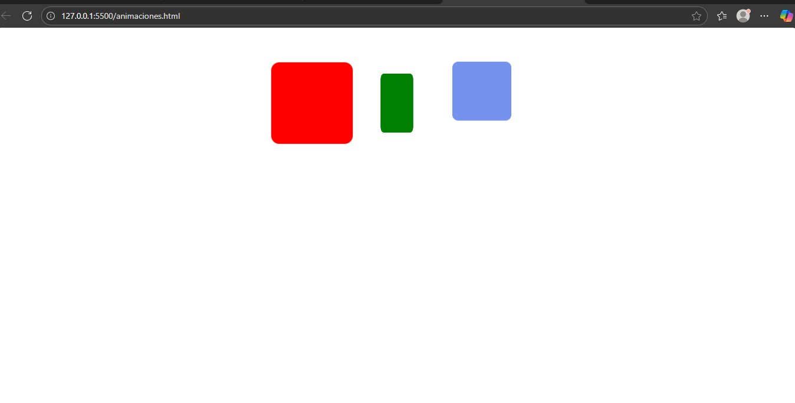

# Laboratorio 8 – HTML y CSS Avanzado

Este laboratorio incluye ejercicios de maquetación con **Flexbox**, diseño **responsive** y **animaciones con CSS**.

## 🧪 Contenido

- Práctica interactiva con Flexbox: [Flexbox Froggy](https://flexboxfroggy.com/#es)
- Página web responsive con HTML y CSS
- Animaciones simples con `@keyframes`

## 📂 Archivos del proyecto

- `index.html` – Página principal responsive
- `pagina-styles.css` – Estilos para la página principal
- `animaciones.html` – Página con animaciones CSS
- `animaciones-styles.css` – Estilos de las animaciones
- Capturas de pantalla:
  - `flexboxfroggy.png`
  - `responsive-escritorio.png`
  - `animaciones.png`

## 🧰 Tecnologías utilizadas

- HTML5
- CSS3 (Flexbox, Media Queries, Animaciones)
- Visual Studio Code
- Git y GitHub

## 📸 Capturas de pantalla

### 🎮 Flexbox Froggy (nivel final)

### 🖥️ Página Responsive (vista escritorio)

### 🎞️ Animaciones con CSS

## ✅ Estado del proyecto

✔️ Finalizado y enviado para revisión.
